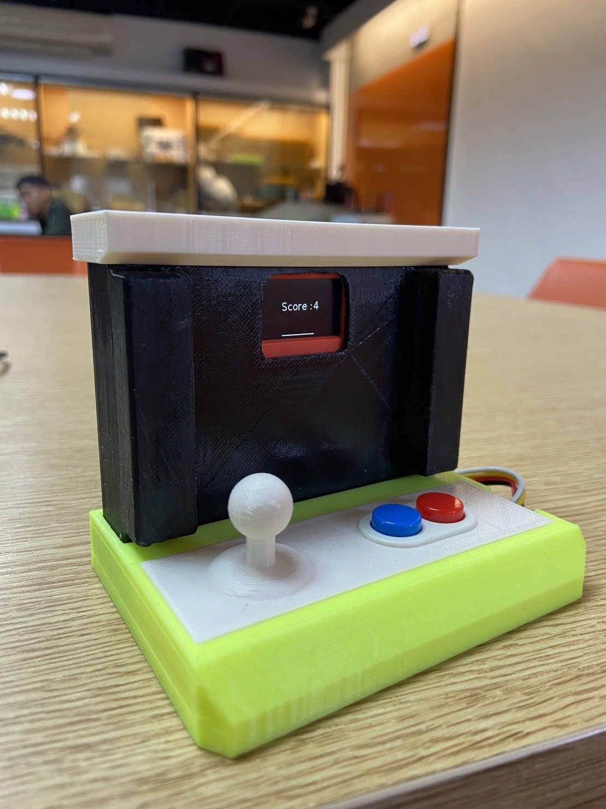
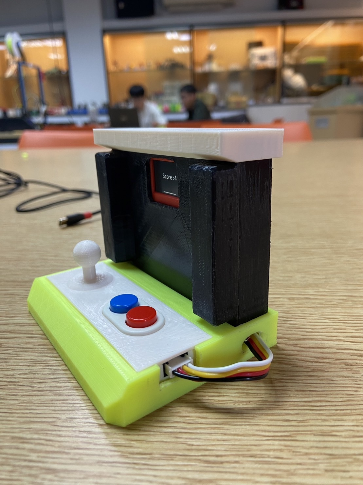
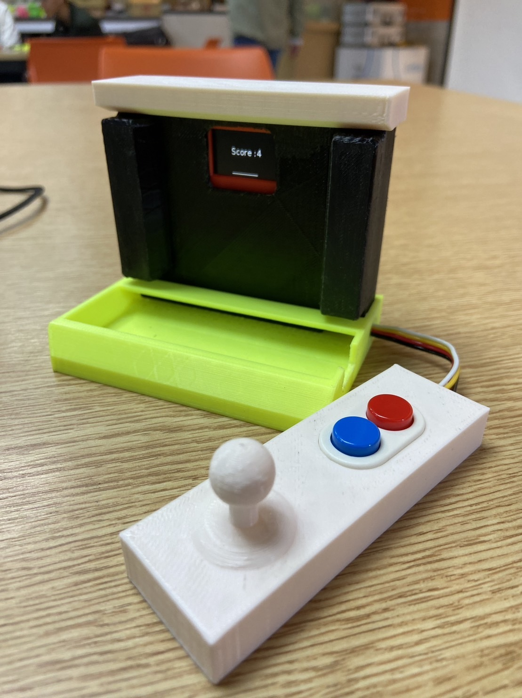
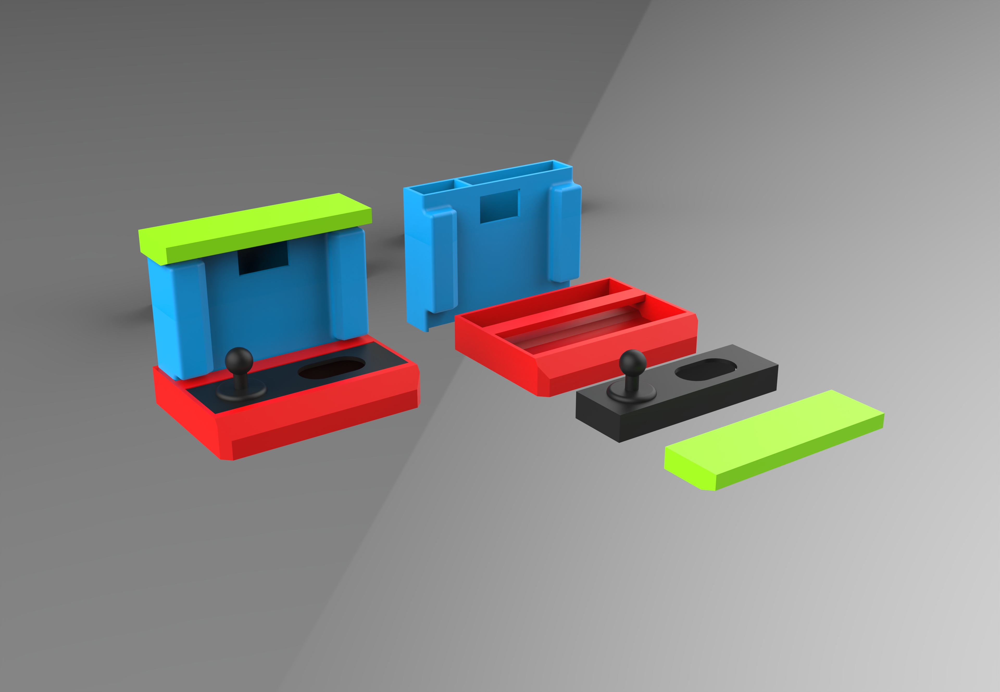

# UiFLow_簡易接硬幣  

### 使用元件：
- M5Stack 主機
- 雙按鈕擴充模組（DUAL_BUTTON）
- 3Ｄ 列印工件（本人創作，請勿販賣）<br>
  🔗 [3D 模型下載](./3D_OBJ/)

### 正面圖(左)、測面圖(中)及拆分模式(右)
<p>
	
	
	
</p>  

&emsp; - 零件完整彩現圖

<p align="left">
  
</p>

---
### 初始化：

```
rectangle0 = M5Rect(8, 70, 2, 90, 0xFFFFFF, 0xFFFFFF)  # 中間的接球區
label0 = M5TextBox(83, 70, "Score:00", ...)  # 顯示分數
```

### 控制邏輯：  
玩家可以操作雙按鈕： 

○ 藍色按鈕 對應往左邊（線的Y值 = -1）  
○ 紅色按鈕 對應往右邊（線的Y值 =  1）  

```python
def btnBlue0_wasPressed(): LineY = -1  #按下藍色按鈕，對應往左邊 -1
def btnBlue0_wasReleased(): LineY = 0  #放開藍色按鈕，就不動
def btnRed0_wasPressed(): LineY = 1    #按下紅色按鈕，對應往右邊 -1
def btnRed0_wasReleased(): LineY = 0   #放開紅色按鈕，就不動
```

### 遊戲主迴圈：
```
for count in range(10):
    if random.randint(1, 3) == 1:  # 左邊球出現
        ...
    elif random.randint(1, 3) == 2:  # 中間球
        ...
    elif random.randint(1, 3) == 3:  # 右邊球
        ...
```
每次隨機選擇一條軌道，從右往左動畫移動一個圓形（球），如果球抵達左邊、而使用者有按對應的方向，就加分。
